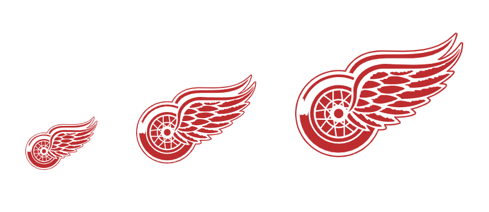

Inspired by [Chris Katsaras'](https://github.com/ChrisKatsaras) [_React NBA Logos_](https://github.com/ChrisKatsaras/react-nba-logos), I've released a variation for NHL logos. The repository is [available on Github](https://github.com/bradmcgonigle/react-nhl-logos) as well as [a NPM package](https://www.npmjs.com/package/react-nhl-logos).

The package includes the primary logos for all 31 NHL teams as well as the NHL shield logo in SVG format available as React components. A few years ago I watched [Why Inline SVG is Best SVG](https://www.youtube.com/watch?v=af4ZQJ14yu8) and it still remains a great explainer for why using inline svgs is better than using the various [methods of displaying SVGs](https://css-tricks.com/using-svg) on a webpage. [React NHL Logos](https://github.com/bradmcgonigle/react-nhl-logos) has a component for each team and NHL logo which outputs an inline SVG making it a breeze to manipulate, animate or alter directly.

Below is part of the [README](https://github.com/BradMcGonigle/react-nhl-logos/blob/master/README.md) for the package which details installation, usage and the available configuration options _(there is only one right now)_ but I have a few more ideas for things like alternate logos that I hope to include in a future release.

## Install

```shell
$ npm install react-nhl-logos
```

## Usage

```js
import React from 'react'
import { DET } from 'react-nhl-logos'

const Example = () => {
  return <DET />
}

export default Example
```

or include all icons

```js
import React from 'react'
import * as NHLLogos from 'react-nhl-logos'

const Example = () => {
  return <NHLLogos.DET />
}

export default Example
```

## Configuration

Size can be easily configured (Default of 100px)

```js
import React from 'react'
import { DET } from 'react-nhl-logos'

const Example = () => {
  return (
    <div>
      <DET size={60} />
      <DET />
      <DET size={140} />
    </div>
  )
}

export default Example
```

Results in


